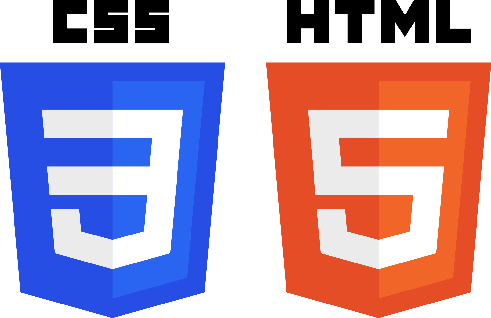
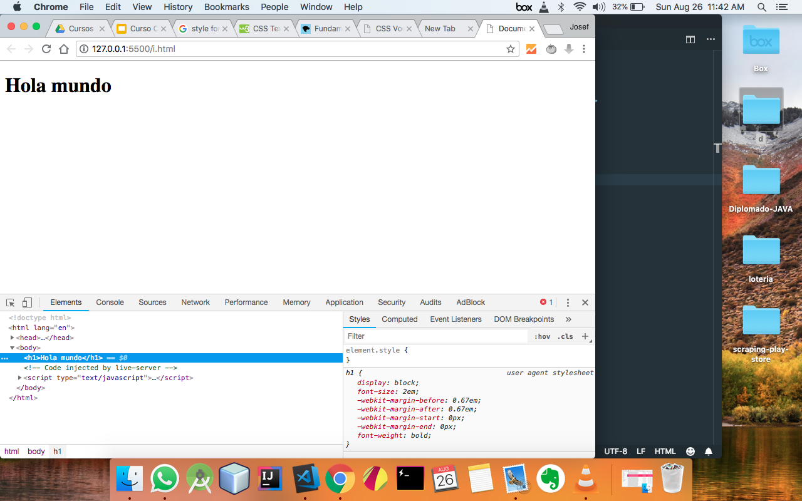
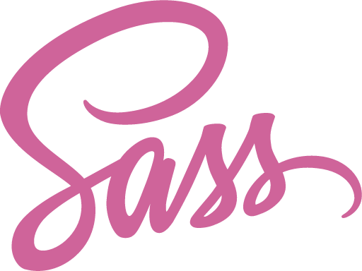

# CSS

# CSS

__CASCADE__

__STYLE__

__SHEET__

_Hoja de Estilo en Cascada: Se irá leyendo de arriba a abajo. La última propiedad siempre gana._

# Agregando CSS

En línea:

__<elemento__      __style=__    “estilos”  __>__    Texto    __\</elemento>__

__\__

__<link__      __rel=__   "stylesheet"    __href__   ="ruta del archivo"  __>__

# Sintaxis

/\*Bloque\*/

__s__  __elector \{__

__propiedad\-1 __  __:__    _valor _  __;__  _ _  __;__

__	propiedad\-2__  __:__   _valor_   __;__

__\}__

# Selectores

Selector de :

Etiqueta \(tipo\) \(HTML\)

Clases

ID

Universal \( \* \)\, root \(html\)

Descendiente \(padre \[espacio\] hijo \{ … \} \)

De atributo

_[http://apps\.workflower\.fi/vocabs/css/en](http://apps.workflower.fi/vocabs/css/en)_   

# Variables CSS

Es un espacio de memoria donde almacena un valor\.

__\-\-__  __nombre\-variable :__   _valor _  __;__

__\-\-__  __color\-primary : __ red __;__

__\-\-ancho\-maximo:__  720px __;__

Utilizando la variable:

__background\-color: __  __var__  __\(__  _ _  _\-\-color\-primary_  _ _  __\);__

# Estilo para textos

Color:   _Da color a la fuente_

Text\-align:  _Alineación horizontal_

Text\-decoration: Especifica la decoración agregada al texto

Text\-transform: Controla mayúsculas y minúsculas del texto

Letter\-spacing:  _Incrementa o decrementa el espacio entre letras_

Line\-height: Espacio del interlineado

Word\-spacing:  Separación entre palabras

Text\-shadow: Sombreado al texto

# Texto

* __Color__ : _ _  _red | \#ff22AC | rgb\(255\,100\,0\)_  _  | hsl\(240\, 100%\, 25%\)_ ;
  * _[https://www\.w3schools\.com/colors/colors\_names\.asp](https://www.w3schools.com/colors/colors_names.asp)_   
* __Text\-align __  :   _center | left | right | justify_  ;
* __Text\-decoration __  :   _none | overline | line\-through | underline_   ;
* __Text\-transform __  :   _uppercase | lowercase | capitalize_  ;
* __Letter\-spacing __ :    _\(\+/ \- \) px | em | rem_  ;
* __Word\-spacing __  :   _\(\+/ \- \) px | em | rem_  ; 
* __Line\-height __  :    _px | em | rem | unidad_  ;
* __Overflow\-wrap__   :   _normal | break\-word_   ;   _[\->](https://developer.mozilla.org/en-US/docs/Web/CSS/overflow-wrap)_
* __white \-space __  :   _nowrap | wrap | pre | normal_  ;
  * _[https://www\.w3schools\.com/cssref/pr\_text\_white\-space\.asp](https://www.w3schools.com/cssref/pr_text_white-space.asp)_   
* __Text\-overflow __  :    _clip | ellipsis | initial | inherit _  ;   _[\->](https://www.w3schools.com/cssref/css3_pr_text-overflow.asp)_

Pulgadas \(in\)

Centimetros \(cm\)

Milimetros \(mm\)

Pixels \(px\)

Puntos \(pt\)

# Unidades de medidas

# Absolutas

_[https://developer\.mozilla\.org/en\-US/docs/Web/CSS/length](https://developer.mozilla.org/en-US/docs/Web/CSS/length)_

Contenedor \(%\)

Tipografía

em \(Contenedor\)

rem \(Root \-> html \-> body\)

Viewport

Ancho ventana\(vw\)

Alto ventana \(vh\)

# Unidades de medidas

# Relativas

_[https://developer\.mozilla\.org/en\-US/docs/Learn/CSS/Introduction\_to\_CSS/Values\_and\_units](https://developer.mozilla.org/en-US/docs/Learn/CSS/Introduction_to_CSS/Values_and_units)_   

# Fonts

Font\-family :  _Define la fuente _  _tipográfica_  _ que será aplicada al texto\._

Font\-size :  _Define el tamaño de la fuente _

Font\-style :  _Formato de la fuente _

Font\-weight :  _Le da el peso a la fuente \(que tan bold será\)_

__Font\-family __ :  _web fonts_ ;

__Font\-size__   :    _px | em | rem_  ;

__Font\-style __ :  _normal | italic_  ;

__Font\-weight__  :  _normal | bold | lighter | bolder | 100\-900 _ ;

_[@font\-face](https://developer.mozilla.org/en-US/docs/Web/CSS/@font-face)_

Recursos:

_[https://fonts\.google\.com](https://fonts.google.com)_     

# Estilos por defecto

El navegador contiene sus propios estilos por defecto en todos los elementos del HTML\.

_[Normalize](https://necolas.github.io/normalize.css/)_

# Selectores

# Selector de Tipo

Selector de tipo  \(etiqueta HTML\)\, NO los uses a menos que sea el estilo base o de tema\.

_body_ \{

\}

_h1_  \{

\}

_p_  \{

\}

# Selector de ID

_NO los uses\._

__<h1 __  _id_  _= “title”_ > Titulo del sitio  __\</h1>__

_\#title_  _ _  __\{ __ /\* referencia al pdf\*/

__color__ : red;

__\}__

# Selector de Clase

Siempre debes usar clases para tus estilos\.

__<h1 __  _class _  _= “title”_ > Titulo del sitio  __\</h1>__

_\.title_  _ _  __\{__

__text\-align__ : center;

__\}__

# Especificidad (Specificity)

__Inline__  = 1000

__ID__  = 100

__Class__  = 10

__Type__  = 1

_\!important_   /\*Nunca lo uses a menos que sea de vida o muerte\*/ Su valor es infinito

_[https://www\.w3schools\.com/css/css\_specificity\.asp](https://www.w3schools.com/css/css_specificity.asp)_   

_[https://developer\.mozilla\.org/en\-US/docs/Web/CSS/Specificity](https://developer.mozilla.org/en-US/docs/Web/CSS/Specificity)_   

# Selectores compuestos

Están formados por más de una palabra\.

Descendientes \( _Espacio entre selectores_ \)

__ancestro__   _descendientes_  \{  /\* Estilos\*/

\}

Hijo directo \( > \)

__padre__   _>_   _hijo_  \{  /\* Estilos\*/

\}

Hermano siguiente \(adyacente\) \(  _\+ _ \)

__elemento__  __ __  _\+_  __ __   _hermano\-siguiente_  \{  /\* Estilos\*/

\}

Hermanos siguientes   \( ~ \) \(Todos los siguientes\)

__elemento__   _~_   _hermanos\-siguientes_  \{  /\* Estilos\*/

\}

Selector compuesto \(sin espacios\) \[tenga ambos selectores\]

__selector__  _selector_  \{  /\* Estilos\*/

\}

Selectores agrupados \(  __\,__  \) \[separados por comas\]

__selector\, __  _selector\, \.\,\.\._  \{  /\* Estilos\*/

\}

# Selectores de atributo

_Sintaxis:_

_selectorTipo_  _\[attribute\]_   __\{__  /\* Estilos \*/

__\}__

_a_  _\[href \] _ \{

__text\-decoration: none;__

\}

_[https://developer\.mozilla\.org/en\-US/docs/Learn/CSS/Introduction\_to\_CSS/Attribute\_selectors](https://developer.mozilla.org/en-US/docs/Learn/CSS/Introduction_to_CSS/Attribute_selectors)_

_[https://developer\.mozilla\.org/en\-US/docs/Web/CSS/Attribute\_selectors](https://developer.mozilla.org/en-US/docs/Web/CSS/Attribute_selectors)_   

* Comienza con \(^\)
  * _\[title_  _^_  _=“palabra”_  _\] _ \{ … \}
* Termina con \($\)
  * _\[_  _src_  _$_  _=“_  _\.jpg_  _”\] _ \{ … \}
* Contiene \( \* \)
  * _\[_  _href_  _\*_  _=“\._  _pdf_  _”\] _ \{ … \}
* Comienza especificamente con \(|\)
  * _\[class_  _|_  _=“menu”\] _ \{ … \}
* Contiene especificamente la palabra \(~\)
  * _\[id_  _~_  _=“header”\] _ \{ … \}
* Ignora mayúsculas y minúsculas \(i o I \)  _\[src=“imagen” i \] _ \{ … \}
* _[https://www\.w3schools\.com/css/css\_attribute\_selectors\.asp](https://www.w3schools.com/css/css_attribute_selectors.asp)_   

# Pseudo clases

# Pseudo-clases ( : )

Son selectores dinámicos\, responden a ciertas eventos que suceden con el elemento\.

Sintaxis:

__selector__  _:_  _pseudo\-class_   __\{__  /\* Estilos \*/

__\}__

_:_  _pseudo\-class_ \{ … \}  /\*se aplica a cualquier elemento\*/

_[https://developer\.mozilla\.org/en\-US/docs/Learn/CSS/Introduction\_to\_CSS/Pseudo\-classes\_and\_pseudo\-elements](https://developer.mozilla.org/en-US/docs/Learn/CSS/Introduction_to_CSS/Pseudo-classes_and_pseudo-elements)_   

_[https://www\.w3schools\.com/css/css\_pseudo\_classes\.asp](https://www.w3schools.com/css/css_pseudo_classes.asp)_   

* :hover \->  _Se activa al pasar el puntero sobre el elemento_
* :active \->  _Cuando se da click sobre el elemento_
* :link \->  _Link sin visitar aún_
* :visited \->  _Cuando ya ha sido visitado el enlace_
* :target \->  _Cuando mandan a llamar al elemento_
* :not\( __selector__ \) \-> Selecciona los elementos que NO coinciden con el selector\.
  * _[https://www\.w3schools\.com/cssref/sel\_not\.asp](https://www.w3schools.com/cssref/sel_not.asp)_
  * _[https://developer\.mozilla\.org/en\-US/docs/Web/CSS/:not](https://developer.mozilla.org/en-US/docs/Web/CSS/:not)_

:empty \-> _ Te indica un elemento que está vacío\, es decir\, que no tiene hijos o texto_

:checked \->  _Si se activo la propiedad checked \(radio\, checkbox\, select\)_

:focus \->  _Se activa cuando tiene el focu el input_

:enabled \->  _Se ejecuta cuando el input está disponible_

:disabled \->  _Se ejecuta cuando el input está deshabilitado_

:required \->  _Se activa cuando el input es requerido\, pero no opcional_

:optional \->  _Cualquier input\, select o textarea que no tenga _  _required_

# Pseudo-clases (child )

:first\-of\-type \-> _ Encuentra el primer tipo de elemento_

:last\-of\-type \->  _Encuentra al último _  _tipo de elemento_

:nth\-of\-type\(n\) \->  _Encuentra al _  _tipo de elemento_  _  “n” \[odd\, even\, X\,\.\.\.\]_

:nth\-last\-of\-tupe\(n\) \->  _Es igual a nth\-of\-type\, solo que la cuenta comienza del final al principio_

# Modelo de Caja

# Elements
Block vs Inline

# Margin

Margin\-top:  _px | em | rem | % | auto_  ;

Margin\-bottom:  _px | em | rem | % | auto_  ;

Margin\-left:  _px | em | rem | % | auto_  ;

Margin\-right:  _px | em | rem | % | auto_  ;

Margin: margin\-top margin\-right margin\-bottom margin\-left;

Margin: \(margin\-top  & margin\-bottom\) \(margin\-right & margin\-left\);

Margin: \(margin\-top & margin\-right & margin\-bottom & margin\-left\); /\*todos\*/

# Colapsado de márgenes

# Padding

Padding\-top:   _px | em | rem | % _ ;

Padding\-right:   _px | em | rem | % _ ;

Padding\-bottom:   _px | em | rem | % _ ;

 Padding\-left:   _px | em | rem | % _ ;

Padding: padding\-top padding\-right padding\-bottom padding\-left;

Padding:    _\(padding\-top & padding\-bottom\)  \(padding\-right  & padding\-left\)_    ;

Padding:    _\(padding\-top & padding\-right & padding\-bottom & padding\-left\)_    ;

# Border-radius

# Ancho y Alto

Width:  _px | em | rem | % | view | auto_  ;

Height:  _px | em | rem | % | view | auto_ ;

Max\-width:  _px | em | rem | % | view | auto_ ;

Min\-width:  _px | em | rem | % | view | auto_ ;

Max\-height:  _px | em | rem | % | view | auto_ ;

Min\-height:  _px | em | rem | % | view | auto_ ;

# Borde

Border\-width:  _px | em | rem | thin | medium | thick_ ;

Border\-style:  _none | hidden | dotted | dashed | solid | double | groove | ridge | inset | outset_  ;

Border\-color:   _\<rgb\(\)> | \<rgba\(\)> | \<hsl\(\)> | \<hsla\(\)> | \<hex\-color> | \<named\-color>_  ;

Border: _ \<br\-width> || \<br\-style> || \<color>_  ; /\*\*shorthand/

# Box-sizing

# Background

_[Color](https://developer.mozilla.org/en-US/docs/Web/CSS/background-color)_

_[Imagen](https://developer.mozilla.org/en-US/docs/Web/CSS/background-image)_

_[Tamaño](https://developer.mozilla.org/en-US/docs/Web/CSS/background-size)_

_[Repetir](https://developer.mozilla.org/en-US/docs/Web/CSS/background-repeat)_

_[Posición](https://developer.mozilla.org/en-US/docs/Web/CSS/background-position)_

_[Origen](https://developer.mozilla.org/en-US/docs/Web/CSS/background-origin)_

_[Shorthand](https://developer.mozilla.org/en-US/docs/Web/CSS/background)_

# Pseudo-elementos
::before / ::after

# Cursor

# Colores

_[Colores](https://developer.mozilla.org/en-US/docs/Web/CSS/color_value)_

_[RGB \, RGBA \-> Valores 0 \- 255](https://developer.mozilla.org/en-US/docs/Web/CSS/color)_

_[HSL\, HSLA](https://developer.mozilla.org/en-US/docs/Web/CSS/color)_

_[Keyword](https://developer.mozilla.org/en-US/docs/Web/CSS/color)_

_[Hex \(RGB\) \-> \#000000 \- \#ffffff](https://developer.mozilla.org/en-US/docs/Web/CSS/color)_

_[Opacidad](https://developer.mozilla.org/en-US/docs/Web/CSS/opacity)_

_[Filter](https://developer.mozilla.org/en-US/docs/Web/CSS/filter)_

# P O S I T I O N

# Static | Relative | Absolute | Fixed | Sticky
Top - Left - Right - Bottom
Context

# Z-index

# Text Shadow
https://developer.mozilla.org/en-US/docs/Web/CSS/text-shadow
https://www.w3schools.com/cssref/css3_pr_text-shadow.asp

# Transform

Translate

Scale

Rotate

# F L E X B O X

# Flexbox

Necesita de una caja contenedora con sus respectivos hijos\.

Si no tiene hijos; es decir\, otra caja\, pero tiene texto\, el texto es su hijo\.

_[https://developer\.mozilla\.org/en\-US/docs/Learn/CSS/CSS\_layout/Flexbox](https://developer.mozilla.org/en-US/docs/Learn/CSS/CSS_layout/Flexbox)_

_[https://www\.w3\.org/TR/css\-flexbox\-1/](https://www.w3.org/TR/css-flexbox-1/)_

_display_ :  __flex | inline\-flex__

# Flexbox - Row

# Flexbox - Column

# Flexbox - Container

Flex\-direction:  _row_  |  _row\-reverse _ |  _column _ |  _column\-reverse_

flex\-wrap:  _nowrap_  |  _wrap_  |  _wrap\-reverse_

flex\-flow: _ flex\-direction _ || _ flex\-wrap_  \-> shorthand

# Flexbox - Container  (Alineamiento)

_Main Axis:_

_[J](https://developer.mozilla.org/en-US/docs/Web/CSS/justify-content)_  _[ustify\-content](https://developer.mozilla.org/en-US/docs/Web/CSS/justify-content)_ : flex\-start | flex\-end | center | space\-between | space\-around | space\-evenly;

_Cross Axis:_

_[Align\-content](https://developer.mozilla.org/en-US/docs/Web/CSS/align-content)_ : flex\-start | flex\-end | center | space\-between | space\-around | space\-evenly ;  //  __\(wrap\)__

_[Align\-items](https://developer.mozilla.org/en-US/docs/Web/CSS/align-items)_ : flex\-start | flex\-end | center | baseline | stretch; //  __\(no\-wrap\)__

# Flexbox - Item (flex)

Flex:  _none_  | _ flex\-grow_   || _ f_  _lex\-shrink_   || _ flex\-basis_   ;  __\-> __  _shorthand_

_[Flex\-grow](https://developer.mozilla.org/en-US/docs/Web/CSS/flex-grow)_

_[Flex\-shrink](https://developer.mozilla.org/en-US/docs/Web/CSS/flex-shrink)_

_[Flex\-basis](https://developer.mozilla.org/en-US/docs/Web/CSS/flex-basis)_   

Los hijos    _no crecen_    por default\, pero si se encogen para entrar\. Siempre tratan de   ponerse   en una sola línea\.

Flex\-basis gana a width\.

# Flexbox - Item  (Alineamiento)

_[A](https://developer.mozilla.org/en-US/docs/Web/CSS/align-self)_  _[lign\-self](https://developer.mozilla.org/en-US/docs/Web/CSS/align-self)_ : auto | flex\-start | flex\-end | center | baseline | stretch;

_[Order](https://developer.mozilla.org/en-US/docs/Web/CSS/order)_ : \<número entero>

# Responsive Design

# Patrones de Responsive

# Media Querys
https://www.w3schools.com/css/css_rwd_mediaqueries.asp
https://www.w3schools.com/Css/css3_mediaqueries_ex.asp
https://developer.mozilla.org/en-US/docs/Web/CSS/Media_Queries/Using_media_queries

# Frameworks

_[Bootstrap](http://getbootstrap.com/)_

_[Foundation](https://foundation.zurb.com/)_

_[Material Design Lite](https://getmdl.io/)_

_[Pure\.CSS](https://purecss.io/)_

_[Materialize](https://materializecss.com/)_

_[Bulma](https://bulma.io/)_

_[Tailwindcss](https://tailwindcss.com/)_

# Preprosesadores

_[SASS](http://sass-lang.com/)_

_[LESS](http://lesscss.org/)_

_[Stylus](http://stylus-lang.com/)_

_[PostCSS](https://postcss.org/)_

# Bootstrap

# SASS o SCSS

